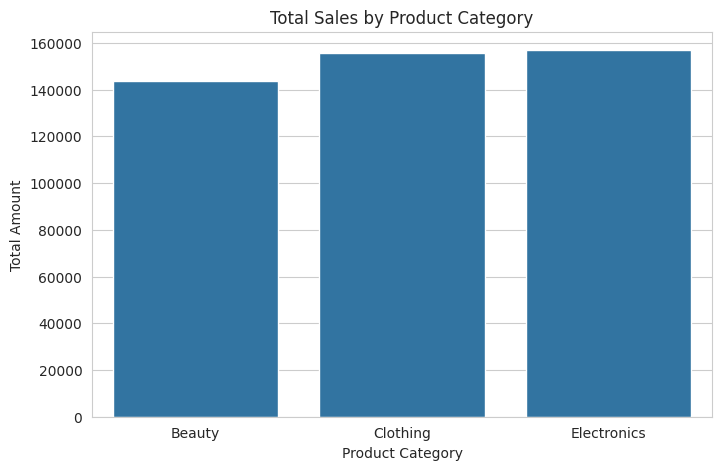
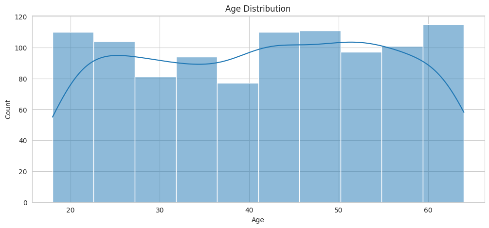
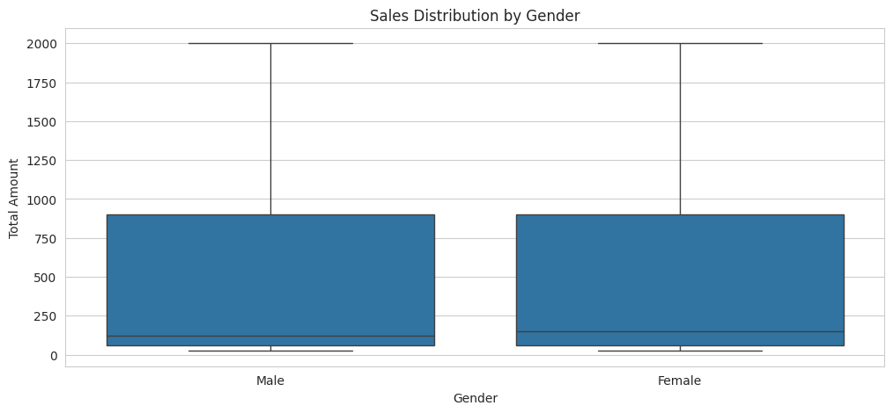

# 🛒 Retail Sales Analysis – Data Analytics Project

This project is a complete end-to-end retail sales analysis built using Python, Pandas, and visualization libraries.  
It explores customer behavior, monthly trends, product category performance, and key revenue drivers using a real retail dataset.

---

## 📌 Features
- Cleaned and processed real-world retail sales dataset  
- Missing value handling & proper date-time formatting  
- Added new features: **Month, Year, Weekday**  
- Exploratory Data Analysis (EDA)  
- Category-wise performance insights  
- Gender-based revenue analysis  
- Sales trend visualizations  
- Cleaned dataset included for reuse  

---

## 🛠️ Technologies Used
- Python  
- Pandas  
- NumPy  
- Matplotlib  
- Seaborn  
- Google Colab  

---

## 📂 Repository Structure
📦 Retail-Sales-Analysis/
│
├── data/
│ ├── retail-sales-dataset.zip # Raw dataset
│ ├── cleaned_retail_sales.csv # Processed dataset
│
├── notebooks/
│ └── retail_sales_analysis.ipynb # Full analysis notebook
│
├── images/
│ ├── category_sales.png
│ ├── monthly_trend.png
│ ├── weekday_sales.png
│ ├── gender_sales.png
│
└── README.md

---

## 📊 Key Visualizations

### **Category Sales Performance**

### **age Sales distribution**

### **Daily sales Forecasting using linear regression**

### **Gender-Based Sales**

---

## ▶️ How to Run the Project

### **1. Clone the Repository**

git clone https://github.com/its-Adarsh2003/Retail-Sales-Analysis.git

2. Install Dependencies
pip install pandas numpy matplotlib seaborn

3. Open the Notebook

Use either:Google Colab/Jupyter Notebook

Open:notebooks/retail_sales_analysis.ipynb

4. Run All Cells

The notebook will:

Load the raw dataset

Clean & process it

Generate all charts

Save the cleaned CSV

📌 Key Insights

Electronics & Clothing generated the highest revenue.

December & November show strong seasonal peaks.

Saturday has the most sales activity.

Female customers contributed slightly more revenue.

Sales dominated by the 25–40 age group.

📬 Contact
If you’d like help with Data Analytics, EDA reports, dashboards, or ML projects, feel free to reach out!

LinkedIn: www.linkedin.com/in/adarsh-dubey-81881a2a5
Email: dubeyadarsh138@gmail.com

⭐ If you found this project useful, please consider giving it a star!
